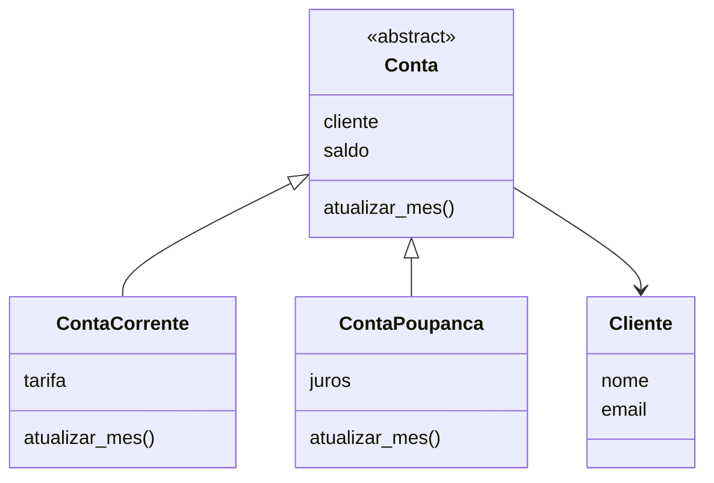

# Sistema Bancário - Semana 06

Sistema simples de banco com clientes e contas.

## Diagrama de classes



## Modelagem

Usei herança nas contas porque conta corrente é uma conta e poupança também é uma conta. As duas aproveitam o saldo e o cliente da classe Conta.

Usei composição com o cliente porque a conta tem um cliente, ela não é um cliente.

A classe Conta é abstrata porque não existe uma conta "genérica", toda conta é corrente ou poupança.

## Validações

- email: tem que ter @, senão dá ValueError
- saldo: não pode ser negativo, senão dá ValueError

As duas usam @property, então a validação roda toda vez que o valor muda.

## Exemplo de uso

```python
ana = Cliente("Ana", "ana@gmail.com")
conta = ContaCorrente(ana, 1500, 20)
conta.atualizar_mes()
print(conta)
```

Saída:

```
Corrente: Ana - R$ 1480.00
```
